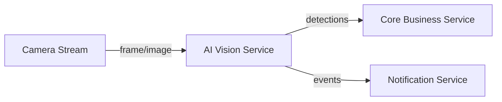

# Service Boundary

## 1. Tên Service
AI Vision Inference Service

## 2. Bài toán Service giải quyết
Service nhận ảnh hoặc frame từ camera, chạy inference bằng mô hình AI để phát hiện đối tượng và trả về kết quả có confidence score. Service chịu trách nhiệm về tiền xử lý, gọi mô hình và trả kết quả định dạng chuẩn cho các service phía sau. Service không tự quyết định hành động tiếp theo như gửi cảnh báo hay kích hoạt workflow.

## 3. Actor
- Camera / IoT device
- Monitoring dashboard
- Core Business Service

## 4. Responsibility
- Nhận input ảnh hoặc frame từ upstream
- Tiền xử lý dữ liệu trước khi infer
- Gọi mô hình AI và tạo kết quả phát hiện
- Trả về kết quả dưới dạng contract chuẩn
- Ghi log, metric và version của mô hình

## 5. Out of scope
- Gửi email, Telegram hoặc cảnh báo cho người dùng
- Quyết định nghiệp vụ sau khi phát hiện
- Lưu trữ dữ liệu lâu dài trong database hoặc warehouse
- Huấn luyện hoặc fine-tuning mô hình

## 6. Input

| Field | Type | Required | Ý nghĩa |
|---|---|---|---|
| camera_id | string | yes | Mã định danh camera phát ảnh |
| image_url | string | yes | Đường dẫn hoặc URL của ảnh/frame |
| timestamp | string | yes | Thời điểm chụp hình |
| model_version | string | no | Phiên bản mô hình dùng cho inference |

## 7. Output
- detection_id: mã kết quả phát hiện
- label: nhãn đối tượng phát hiện
- confidence: độ tin cậy
- bbox: vùng phát hiện
- model_version: phiên bản mô hình
- status: trạng thái xử lý

## 8. Provider / Consumer
- Provider: AI Vision Inference Service
- Consumer: Core Business Service, Notification Service, Monitoring Dashboard

## 9. Upstream / Downstream
- Upstream: Camera Stream, Image Storage, Event Bus
- Downstream: Core Business Service, Alerting Service

## 10. API dự kiến
- POST /v1/inference
- Request: camera_id, image_url, timestamp, model_version
- Response: detection_id, label, confidence, bbox, model_version, status

## 11. Event dự kiến
- image.received
- inference.completed
- inference.failed

## 12. Boundary Diagram

## 13. Vấn đề cần đàm phán ở Buổi 2
1. Contract giữa AI Vision Service và Core Business về schema kết quả.
2. Chính sách retry, timeout và độ trễ tối đa.
3. Cách quản lý model version và rollback.
